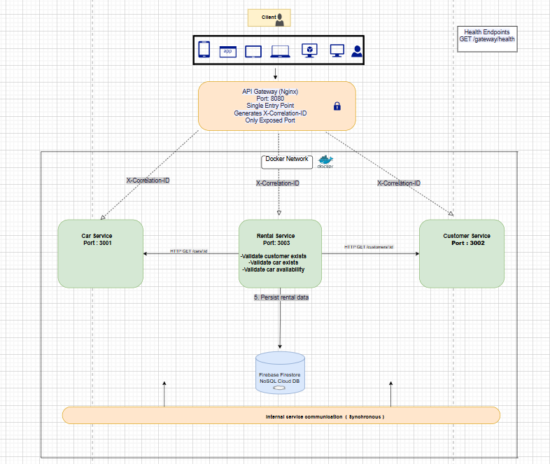
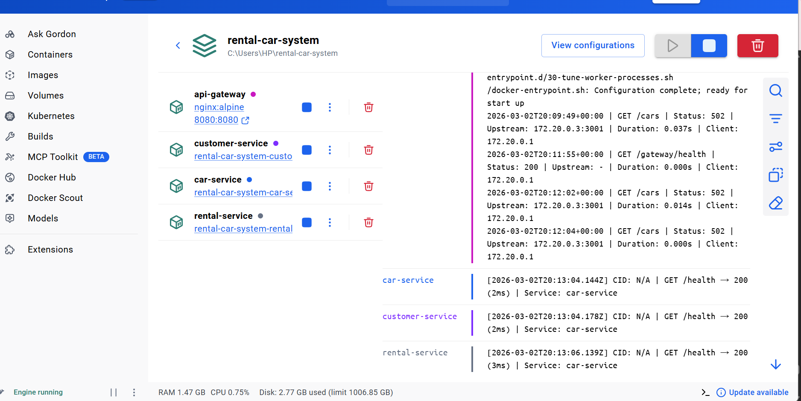
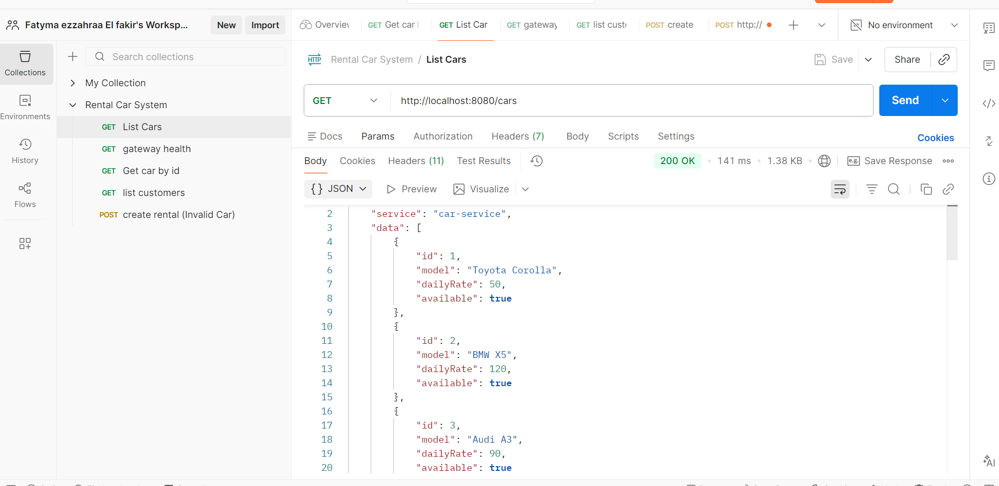
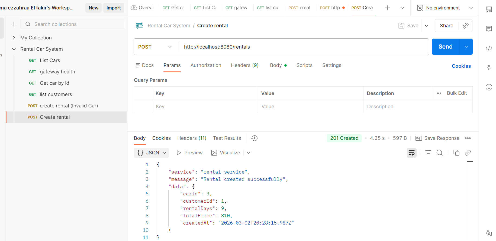
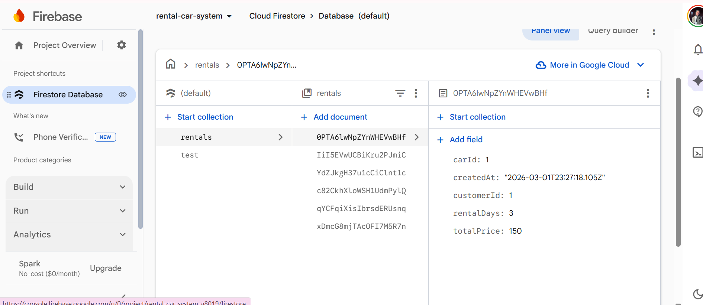

Rental Car System – Cloud Native Backend
1. Project Description

This project is a cloud-native backend system for a Rental Car platform.

The system is designed using a microservices architecture and containerized with Docker. It demonstrates cloud-native principles including:

Service isolation

Inter-service REST communication

API Gateway pattern

Stateless containers

Externalized configuration

Cloud persistence integration

Request tracing using correlation IDs

The system consists of three microservices and an API Gateway. The Rental Service integrates with Firebase Firestore to provide persistent cloud storage.

2. Architecture Overview

The system is composed of:

Car Service (Port 3001)

Manages car data and availability.

Customer Service (Port 3002)

Manages customer records.

Rental Service (Port 3003)

Creates rental records

Validates customer existence

Validates car existence and availability

Stores rental data in Firebase Firestore

API Gateway (Port 8080)

Single external entry point

Routes requests to internal services

Generates and propagates X-Correlation-ID

Only exposed port to host machine

All services run inside a Docker network called:

backend-net (Internal Only)

Only port 8080 is exposed to the host.

3. System Architecture Diagram

The diagram below illustrates:

All components and ports

Docker network boundary

Cloud integration (Firestore)

Complete data flow for POST /rentals

Validation logic location

Correlation ID propagation

Health check endpoints

4. Cloud Integration

The Rental Service integrates with Firebase Firestore as a managed cloud database.

Rental records are persisted in Firestore, ensuring that:

Data is not lost when containers restart

The system remains stateless

Externalized storage is used (cloud-native principle)

Firestore is external to the Docker network.

5. Environment Configuration

Each service uses environment variables for configuration.

Car Service
PORT=3001
Customer Service
PORT=3002
Rental Service
PORT=3003
CAR_SERVICE_URL=http://car-service:3001
CUSTOMER_SERVICE_URL=http://customer-service:3002
Firebase Configuration

You must place your Firebase credentials file:

rental-service/serviceAccountKey.json

This file is excluded from version control for security reasons.

6. Correlation ID and Logging

The API Gateway generates a unique X-Correlation-ID for every incoming request.

This ID is:

Added to request headers

Propagated to all services

Logged by each service

This allows distributed request tracing across the microservices.

Each service also includes:

Request/response logging middleware

Structured response envelope with service identifier

Meaningful HTTP status codes and error messages

7. Health Endpoints

Each service exposes a health endpoint:

GET /gateway/health

GET /health (Car Service)

GET /health (Customer Service)

GET /health (Rental Service)

These endpoints allow monitoring of service availability.

8. How to Run the Project
Step 1 – Clone the Repository
git clone https://github.com/FatimaEzzahra-ELFAKIR06/rental-car-system
cd rental-car-system
Step 2 – Add Firebase Credentials
Place your serviceAccountKey.json file inside:
rental-service/
Step 3 – Start the System
docker-compose up --build
Step 4 – Access the System

All API requests must go through:

http://localhost:8080

Ports 3001, 3002, and 3003 are internal only.

9. API Endpoints
Gateway Health Check
GET http://localhost:8080/gateway/health
List Cars
GET http://localhost:8080/cars
List Customers
GET http://localhost:8080/customers
Create Rental
POST http://localhost:8080/rentals

Request Body Example:

{
  "carId": 2,
  "customerId": 2,
  "rentalDays": 7
}

Successful response:

HTTP 201 Created

Rental stored in Firestore

10. Screenshots
Docker Containers Running

GET /cars Endpoint

POST /rentals Success

Firestore Stored Rental

11. Deployment

This project runs locally using Docker Compose.

All services are accessed through:

http://localhost:8080

Firebase Firestore is the only external cloud integration used.

12. Repository Structure
rental-car-system/
├── car-service/
├── customer-service/
├── rental-service/
├── api-gateway/
├── docker-compose.yml
├── postman-collection.json
├── architecture-diagram.png
├── screenshots/
└── README.md

13. Technologies Used

Node.js (Express)

Nginx (API Gateway)

Docker & Docker Compose

Firebase Firestore

Postman

Mermaid / Draw.io (Architecture Diagram)